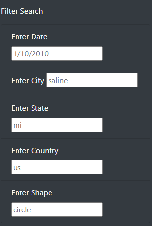

# UFOs

## Project Overview
This analysis seeks to provide the capability to read through various recorded UFO sightings from across the world. Using JavaScript's visual functionality, we are able to display the data as a table. Furthermore, my code provides a means of sifting through the data by way of being able to manipulate the data with filters. Additionally, my website can host articles about UFO sightings on a tidy HTML page, holding both the article and the manipulatable data table.

## Resources
- Data sources: data.js
- Software: Visual Studio Code 1.60.2, JavaScript 1.7

## Results
My website allows for individuals to search for various UFO sightings in a myriad of ways. I have provided five different search fields. There are filter fields that my code can utilize to sift through the data in the table my webpage displays. Should the user decide to input one, two, or all the way up to five search criteria, *if* the inputs exist in the table, then my page will refresh and only display sightings that match the criteria of the user's input. If the user's input does not match the filters for any sightings on my page, then no sightings will be presented. If any matches arise, then they will be displayed for the user to read more up on.

Here are the five search fields which can be filled in by any user. If a field is not filled in, then my code filters without that criteria.

