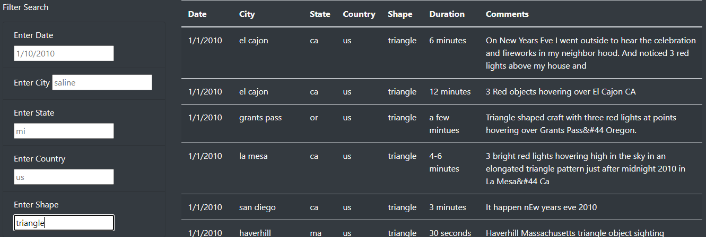

# UFOs

## Project Overview
This webpage seeks to provide the capability to read through various recorded UFO sightings from across the world. Using JavaScript's visual functionality, I am able to host an article about UFO sightings on a tidy HTML webpage. This page displays a data table which can be manipulated with filters, as well.

## Resources
- Data sources: data.js
- Software: Visual Studio Code 1.60.2, JavaScript 1.7, D3.js, HTML 5, CSS 3, Bootstrap

## Results
My website allows for individuals to search for various UFO sightings in a myriad of ways.

I have provided five different search fields for users to input into. Should the user decide to input one, two, or all the way up to five search criteria, *if* the inputs match any filters in the table, then they will be displayed for the user to read more up on. If the user's input does not match the filters for any sightings on my page, then no sightings will be presented. 

Above, you can see there are the five search fields which can be filled in by any user. If a field is not filled in, then my code filters without that criteria.

Below, you can see an individual filter in play: I set the "shape" search field to *triangle* and only sightings that described the UFO as a *triangular shape* were displayed from the original table. Voila!

## Summary
One drawback to this new design of the table is that there is no "refresh" button for the search fields. Rather, the user's only way of clearing the search fields is to clear the search fields and press *enter* in order to return to the original data table. In theory, it takes the same amount of time to clear the field and press *enter* as it does to click a "refresh" button. However, in practice, a "refresh" button feels more useful and appropriate than expecting the user to delete the previously filled-in search fields and then click *enter* again. 

In terms of future development of this webpage, I'd suggest we display a functioning "refresh" button for the search fields. Moreover, having filters on the columns of the data table that users could interact with would allow for more vibrant ways of visualizing the UFO sighting data. For instance, a user could sort by state, to see which states seemingly have the most sightings. Connections could be more easily drawn among sightings if the table was sorted this way. An alternative example is, if sorted by shape, connections among sightings might be drawn more easily by noticing similarly-shaped objects described by multiple parties around the same time. More interactivity built into the data table could bring about more detailed patterns and general utility out of the webpage.